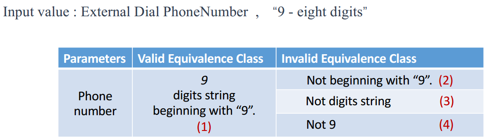
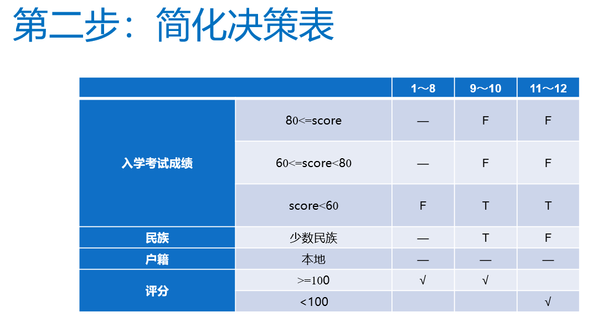
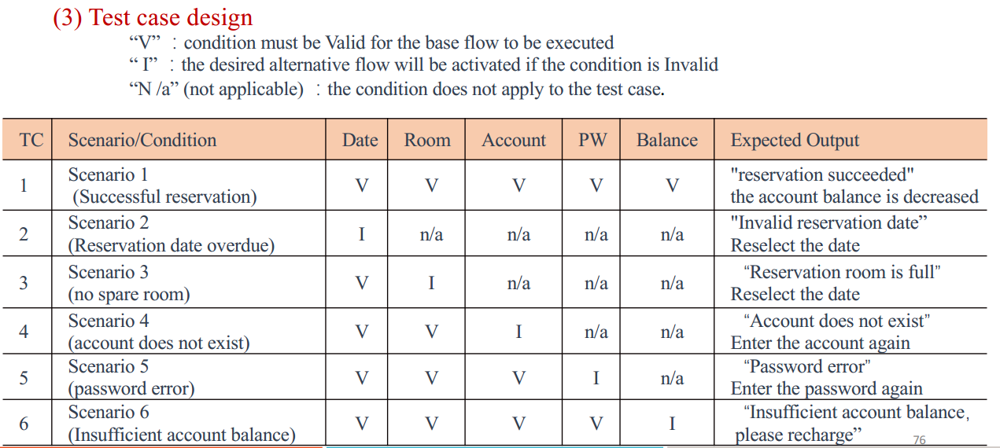
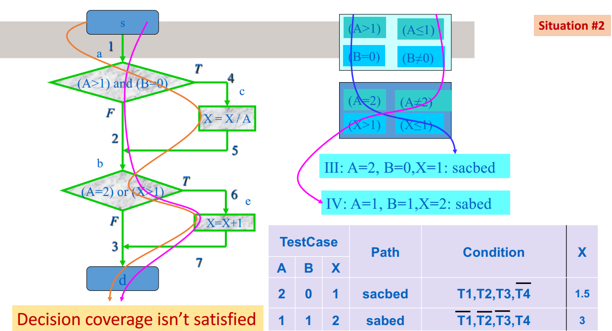

## 1. Introduction

**Verification:** 确定软件开发过程中给定阶段的产品是否满足前一阶段建立的需求的过程

**Validation :**  在软件开发结束时评估软件以确保符合预期用途的过程

**公理：**

1. It is impossible to test a program completely  
2. Software testing is a risk-based exercise  
3. Testing cannot show the absence of bugs
4. The more bugs you find, the more bugs there are  
5. Not all bugs found will be fixed  
6. It is difficult to say when a bug is indeed a bug  
7. Specifications are never final  
8. Software testers are not the most popular members of a project  
9. Software testing is a disciplined and technical profession  

**测试er目标：**1、找bug。 2、尽快找出bug。3、保证它们被修复

## 2. TestProcess

1. 瀑布模型

开始就制定计划且不会改变，子过程无重合。

优点：如果需求和设计正确的话可以省很多时间。强调文档，新人友好。

缺点：变更不灵活；写文档耗时；最后才测试；必须将程序作为一个整体进行测试可能会导致测试不完整；

2. 螺旋模型

3. **V模型**

瀑布模型的扩展,强调V&V

4. **W模型**

两个V模型。

可以开展迭代，进行了一次回归。

5. 敏捷模型

一种增量式模型，强调短时间内构建出可用的软件。当开发人员与客户“协商”即将到来的迭代的需求时，测试人员必须完全参与。当需求发生变化时，测试人员会立即参与进来，因为测试用例必须相应地改变。

**TDD(Test-Driven Development)**

## 3. TestPrinciple

Static Verification (or Static Analysis) 不需要执行软件代码，而Dynamic Verification (or Software Testing) 则需要。

Dynamic Verification需要Test Case

**Black Box testing**完全基于程序规范，旨在验证程序是否满足指定要求

**White box testing**使用软件的实现来派生测试。测试旨在锻炼程序代码的某些方面

黑盒覆盖规范但不覆盖实现，白盒相反

## 4. BlackBox

### 4.1. Equivalence Partitioning 

**等效分区 (Equivalence Partition, EP)** 是规范规定了等效处理的参数的值范围。每个参数必需属于一个EP，EP间没有值。

Equivalence Partitioning是一个把测试用例大集合减小为等价的小集合的过程。

**等价类(Equivalence Class)**形成一个集合的划分

Valid equivalence Class：输入字段中的一组有意义的数据，用于验证系统功能和性能是否能够正确实现。

Invalid equivalence class ：输入字段中的一组无意义的数据。用于测试系统的容错能力

把输入划分为等价类后要构建**等价类表**，给每个等价类ID

而后设计Test Case，注意覆盖表中所有等价类。Test cases for valid classes  每个case要尽可能覆盖多个等价类；Test cases for invalid classes  每个case只覆盖一个等价类。

### 4.2. Boundary Value Analysis 

制定等价分区时选择位于边界上的输入数据.

对于连续数据类型，一个分区顶部值的后继值必须是下一个分区底部的值

### 4.3. Combinational Testing 

**真值表**。程序的输入又称cause，输出又称effect。测试用例涵盖所有可能的因果组合

 	“**Don’t care**(用*表示)” conditions exist where the value of a cause has no impact on the effect.

**决策表**，将许多独立条件与多个动作相关联。

### 4.4. Random Testing and Error Guessing 

**Random Testing**

测试数据是使用随机数生成器生成的。目标是根据每个输入参数的分布，实现对每个输入参数可能值的“合理”覆盖。

每个测试用例由一组（随机）输入值表示，每个参数一个。

很容易以自动化方式实施，但不太可能发现错误。

**Error Guessing** 

选择的测试数据可能会暴露代码中的错误(空值，0等)，是一种基于直觉和经验的临时方法。可以产生正常和错误的测试用例

### 4.5. Scenario Testing  

执行场景测试以确保软件的端到端功能和软件的所有流程正常工作。测试人员假设自己是最终用户，并找到用户可以在软件上执行的真实场景或用例。

(跟UML的用例场景差不多，也分为主成功场景和备选场景)

**步骤：**

(1) 根据说明书，描述被测软件的基本流程和备选流程。
(2)构建不同的场景，满足测试完整性和无冗余的要求。
(3)针对每个场景设计相应的测试用例。
(4) 重新检查所有生成的测试用例，去除多余的测试用例。 确定测试用例后，为每个测试用例确定测试数据值

## 5. WhiteBox

### 5.1. Control Flow Testing  

控制流测试使用程序的控制流作为模型。
Ø 要求测试人员对程序的逻辑结构有清晰的认识，甚至能够掌握源程序的所有细节。
Ø 最适用于新软件进行单元测试

#### 5.1.1.  Statement Coverage 

测试用例的输入值要让源代码中的每个语句都被执行。

#### 5.1.2. Decision Coverage (Branch Coverage) 

测试用例要将代码中的所有true和flase的分支都覆盖。如果达成了分支覆盖，一定达成了语句覆盖。

#### 5.1.3. Condition Coverage  

对于复杂的判断，测试判断中的每个条件的真值和假值，从而扩展了 Branch Coverage，但不一定能达成分支覆盖和语句覆盖。因为并不关心判断本身的结果。

#### 5.1.4. Decision/Condition Coverage 

在 Condition Coverage 的基础上，保证每个判断的true和false分支都要覆盖。

**步骤：**
§ 确定程序中的所有判断(分支)
§ 列出所有条件
§ 生成测试数据以涵盖上述判断和条件

不能保证所有**条件的组合**都被测过。

#### 5.1.5. Condition Combination Coverage

生成测试以覆盖每个判断的每个可能的条件组合。目标是实现每个判断的 100% 覆盖率和每个条件的 100% 覆盖率(如果可以的话)。真值表是识别所有可能值组合的最佳方式。**不一定每条路径都被覆盖。**

#### 5.1.6. Path Coverage 

**控制流图Control Flow Graphs (CFGs)**

**路径覆盖：**生成测试数据以测试程序中的所有不同路径。通过循环进行 i 次迭代的路径不同于通过循环进行 i+1 次迭代的路径，即使在两次迭代中都访问了相同的节点

一个程序的 CFG 可以用一个正则表达式来描述：

(...)*可以化简为(...+0):

路径数量计算：

#### 5.1.7. Basis Path Testing 

定义独立路径的数量，来明确达到最大化覆盖所需的测试用例数量。基本路径测试涉及执行程序中所有可能的块，并以最少的测试用例实现最大的路径覆盖。

**独立路径**被定义为从入口到出口的路径，该路径至少有一条边之前在任何其他路径中都没有被访问过。

**步骤：**

（1）画出控制流图（确定不同的程序路径）
（2） 计算圈复杂度（确定独立路径数的指标）
（3）寻找路径基集
（4）生成测试用例，对每条路径进行演练

圈复杂度$V(G)=E-N+2=P+1=R$。E：边；N：顶点；P：判断节点；R：区域数(包括最外面的区域)

结果表中包含测试用例(输入)，独立路径，输出

## 6. Static Testing 

### 6.1. Static Testing  

静态测试是在不执行软件的情况下仔细而有条不紊地审查和分析软件错误的过程。包括Code Review和Static Program Analysis.

### 6.2. Code Review

基本要素：

1. 识别问题。查找软件问题，例如缺少项目、错误等
2. 遵守规则。要审查的代码量，将花费多少时间
3. 准备。每个参与者都应该做好准备，以便为审查做出贡献
4. 写报告。总结审查结果，向开发团队提供报告

非正式代码审查有**同行评审**和**Walkthroughs**两种。

### 6.3. Program Static Analysis  

略

## 7. Test Documentation 

### 7.1. Test Plan 

测试计划是描述软件测试范围和活动的文档。 它是正式测试项目中任何软件/产品的基础。

**Testing Level Specific:** Test plans for each level of testing:
§ Unit Test Plan
§ Integration Test Plan
§ System Test Plan
§ Acceptance Test Plan  

**Testing Type Specific:** Test plans for specific types of testing like Performance
Test Plan and Security Test Plan.  

**计划测试过程：**

1) 定义测试策略
2) 定义测试系统
3) 估计测试工作量
4) 准备和审查测试计划

### 7.2. Test Case 

测试用例是一组记录在案的先决条件、过程（输入/操作）和后置条件（预期结果）。

### 7.3. Bug Report 

错误报告是概述有关软件问题的信息的文档，要**包括如何复现和定位bug**。目的是修好bug。Bug要有对应id、标题、类型、优先级等信息。

### 7.4. Test Summary Report 

在测试完成后准备，向高级管理人员、客户等各个利益相关者解释有关为项目执行的测试的各种细节和活动。

## 8. Unit Testing 

### 8.1. Unit Testing 

单元测试主要是开发人员编写的**白盒测试**，旨在验证程序功能的小单元。可以帮助定位错误，尽早发现错误，改善代码质量。

### 8.2. Test-Driven Development  

先写测试，再写代码；仅在自动化测试失败时才编写代码；如果通过其他方式发现bug，先写一个失败的测试，再修复bug；尽可能频繁地运行测试，最好是每次更改代码时

### 8.3. Automated Unit Test 

使用测试框架组织和运行单元测试，如xUnit一族。这使开发人员可以快速确认他们的代码在更改后是否正常工作。

测试时常常使用断言。Test Suite是有关联的测试用例的集合。

## 9. Integration Testing 

### 9.1. Definitions 

选择集成测试数据以确保系统的组件或子系统一起正常工作。测试用例将探索组件之间的不同交互，并确保产生正确的结果。

**Drivers and Stubs(驱动和桩)**

 

**驱动程序**调用被测软件，将测试数据作为输入传递。

**桩**是被测软件正常运行所需的临时或虚拟软件，为被测模块编制一些模拟其下级模块功能的“替身”模块，以代替被测模块的接口，接受或传递被测模块的数据

### 9.2. Approaches to Integration Testing 

有**Decomposition-based Integration(基于分解的集成)**，Call graph-based Integration 和 Path-based Integration  三大类。

#### 9.2.1. Decomposition-based Integration

根据系统的功能特性进行分解。

**1. Big bang Integration** 

Ø 将整个系统视为一个子系统
Ø 在单个测试会话中测试所有模块
Ø 只有一个集成测试会话

故障隔离较为困难。**没有驱动和桩**

**2. Top-Down Integration **

可以对功能分解树进行深度优先或者广度优先。

先将所有被调用的单元替换为始终返回正确值的桩，然后再向下的过程中逐步把桩替换为代码。

**3. Bottom-Up Integration **

由驱动提供输入并调用下级的单元。在向上的过程中逐步将驱动替换为代码。

没有原型，主程序被最后测试。

**4. Sandwich integration **

上面两种的结合。一般来说，高层用top-down(桩)，低层用bottom-up(驱动)。顶层和低层可以并行。需要**更少的桩和驱动**。但难以隔离问题。

Decomposition-based Integration**优点：**直观清晰；使用经过验证的组件“构建”；故障隔离因集成的单元数量而异。**缺点：**功能分解中的某些分支可能与实际接口不对应；驱动和桩的开发开销可能很大。

## 10. System Testing 

### 10.1. What is System Testing 

根据场景和需求测试整个系统的行为(在完成了集成测试后)。使用**黑盒**技术。

### 10.2. System Testing Types 

#### 10.2.1. Functional testing 

功能测试验证软件的行为是否符合预期。需要测试非法输入。

#### 10.2.2. Non-functional testing 

包括可用性，安全，性能等。

#### 10.2.3. Regression testing 

确保代码更改没有破坏现有功能、性能和安全性。代码更改后重新运行测试。

**可用性：**花多少时间可以学会使用软件系统，使用的速度如何，出错的可能性多大。

### 10.3. Performance Testing 

用于检查应用程序或软件在工作负载下的响应性和稳定性方面的表现，目标是识别并消除应用程序的性能瓶颈。

**一些指标：**内存使用、CPU使用、响应时间、带宽、吞吐量。

**一些类型：**

负载测试：检查应用程序在预期用户负载下的执行能力。 目标是在软件应用程序上线之前识别性能瓶颈。

压力测试：在极端工作负载下测试应用程序以了解它如何处理高流量或多数据的情况。

**工具：**LoadRunner，JMeter等。

### 10.4. Security Testing 

可以发现系统的漏洞并确定系统的数据和资源是否受到保护以免受可能的入侵者的侵害，可以识别出系统的威胁和脆弱点。

## 11. Automated Software Testing 

### 11.1. Why we need Automated Testing 

软件测试需要快速、准确和可复现。

### 11.2. What is Automated Testing 

借助专门的自动化测试工具，将测试用例的预期结果和实际结果进行比较。

自动化测试**优点：**
§ 支持重复测试用例的执行
§ 帮助测试大型测试矩阵
§ 启用并行执行
§ 鼓励无人值守执行
§ 提高准确性，从而减少人为错误
§ 节省时间和金钱
**缺点：**
§ 自动化工具通常价格昂贵；
§ 无法有效测试应用程序的用户体验；
§ 需要编码知识和经验

## 12. Acceptance Testing 

### 12.1. What is Acceptance Testing  

验收测试是软件测试的最终级别，测试系统是否符合其**业务需求**。
Ø它**由客户或最终用户执行**，目的是查看产品是否适合交付。
Ø在系统测试之后，最终交付给客户之前进行。
Ø工作在**黑盒**测试方法下

### 12.2. Contents of Acceptance Testing 

包括两部分：软件配置审查和软件有效性测试

### 12.3. Installation Testing  

安装测试是一种软件测试，它验证软件的安装过程并确保软件在各种系统和配置上正确安装。它是软件测试过程的一个关键方面，有助于确保软件可以轻松安装、配置和卸载而不会出现任何问题。

### 12.4. Alpha Testing & Beta Testing 

是验收测试类型，有助于建立推出产品的信心，从而使产品在市场上取得成功。
Alpha 和 Beta 测试阶段主要侧重于从已经测试过的产品中发现错误，它们清楚地描述了实时用户如何使用该产品。

#### 12.4.1. Alpha Testing 

Alpha 测试是在开发人员现场进行的验收测试形式。它**可以由内部开发人员**和 QA 以及潜在的最终用户执行。
Alpha测试**不对外开放**。

#### 12.4.2. Beta Testing 

Beta 测试是在**客户或最终用户**一侧进行的验收测试形式。它是在 alpha 测试之后和在**没有开发人员**在场或控制的真实环境中执行的。
Beta 测试或应用程序的 **beta 版本通常对全世界（或客户端）开放。**

## 13. Software Maintenance 

维护是在交付后修改软件系统或组件以纠正错误、提高性能或其他属性或适应变化的环境的过程

维护阶段测试如何做？定义好软件文档，定期发布补丁包。

## 附

**什么是软件质量？**

质量就是要“满足需求”

**软件质量保证三要素？**

软件测试、质量控制、软件配置管理

**PDCA?**

Plan, Do, Check, Act. 通过计划、持行、检查、处理来持续质量改善的过程 .

**软件测试生命周期？**

是一个并行的过程。逻辑设计->物理设计->单元设计->编码

**开展测试？**

